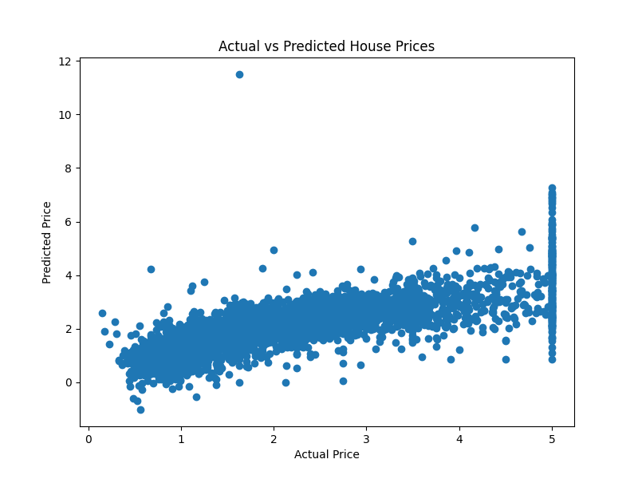
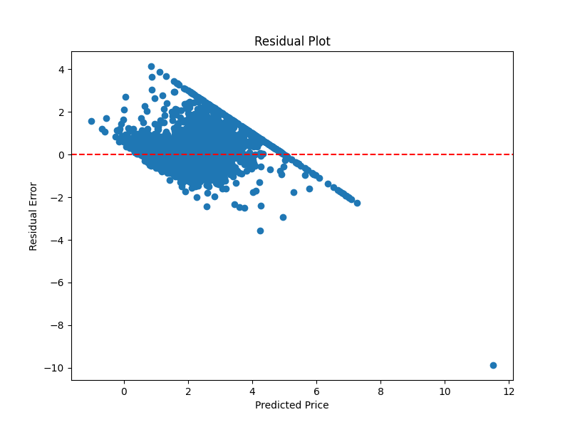

# House Price Prediction using Linear Regression

## Overview

This project demonstrates a machine learning workflow for predicting house prices using the California Housing dataset. The model is built using Linear Regression from Scikit-learn and includes data loading, model training, evaluation, visualization, and model saving.

---

## Features

* Load and preprocess the California Housing dataset
* Train a Linear Regression model
* Evaluate model performance using:

  * Mean Absolute Error (MAE)
  * R² Score
* Visualize Actual vs Predicted House Prices
* Visualize Residual Errors
* Save the trained model using Joblib

---

## Technologies Used

* Python
* Pandas
* Matplotlib
* Scikit-learn
* Joblib

---

## Dataset

This project uses the **California Housing Dataset** provided by **Scikit-learn**.

Dataset Information:

* Number of Samples: 20,640
* Number of Features: 8
* Target Variable: Median House Price

---

## Machine Learning Model

**Algorithm Used:**

* Linear Regression

The dataset was divided into:

* 80% Training Data
* 20% Testing Data

---

## Model Performance

* **Mean Absolute Error (MAE):** 0.5332
* **R² Score:** 0.5758

---

## Project Structure

```text
House_Price_Prediction/
│── house_price_prediction.py
│── house_prices.csv
│── requirements.txt
│── README.md
│── .gitignore
│
├── charts/
│   ├── prediction_plot.png
│   └── residual_plot.png
│
└── venv/
```

---

## How to Run

1. Clone the repository

```bash
git clone https://github.com/YOUR_USERNAME/House_Price_Prediction.git
```

2. Navigate to the project folder

```bash
cd House_Price_Prediction
```

3. Install the required libraries

```bash
pip install -r requirements.txt
```

4. Run the project

```bash
python house_price_prediction.py
```

---

## Output

### Actual vs Predicted House Prices



### Residual Plot



---

## Future Improvements

* Train advanced regression models such as Random Forest Regressor and XGBoost.
* Perform feature engineering and hyperparameter tuning.
* Build a web application using Streamlit for real-time predictions.
* Compare multiple regression algorithms.

---

## Author

**Harshitha Katakam**

GitHub: https://github.com/KatakamHarshitha
